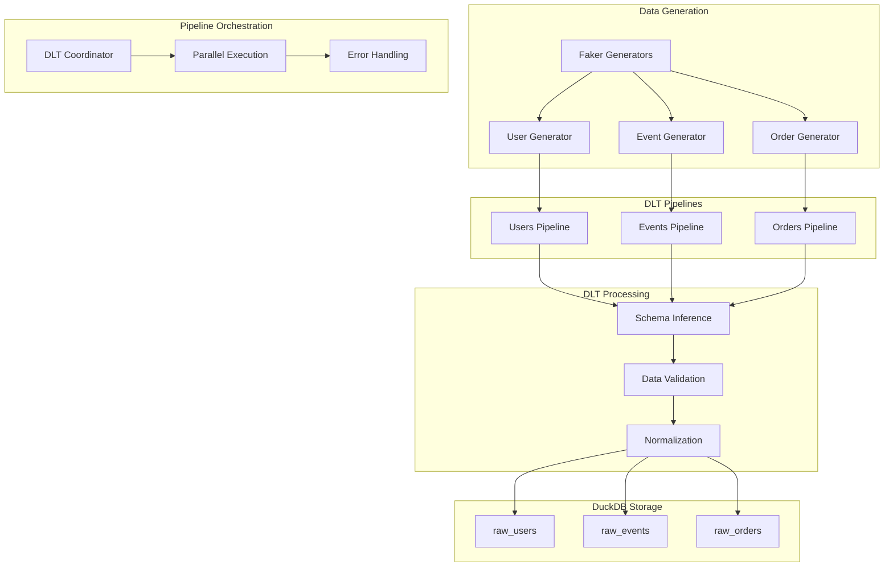

# DLT Pipeline Architecture for SBDK.dev

## Overview
This document defines the Data Load Tool (DLT) pipeline architecture for SBDK.dev, including synthetic data generation, pipeline structure, and integration with DuckDB and dbt.

## 1. Pipeline Architecture Overview



## 2. Synthetic Data Generation Strategy

### Base Data Generator (generators/base.py)
```python
"""
Base data generator with configurable parameters and realistic relationships
"""

from abc import ABC, abstractmethod
from typing import Dict, List, Any, Optional
from datetime import datetime, timedelta
import random
from faker import Faker
from dataclasses import dataclass, field


@dataclass
class GeneratorConfig:
    """Configuration for data generators"""
    seed: int = 42
    start_date: datetime = field(default_factory=lambda: datetime.now() - timedelta(days=365))
    end_date: datetime = field(default_factory=datetime.now)
    locale: str = "en_US"
    batch_size: int = 10000
    
    # Data distribution parameters
    country_distribution: Dict[str, float] = field(default_factory=lambda: {
        "US": 0.4, "GB": 0.15, "CA": 0.12, "AU": 0.08, 
        "DE": 0.1, "FR": 0.08, "JP": 0.07
    })
    
    referrer_distribution: Dict[str, float] = field(default_factory=lambda: {
        "google": 0.35, "direct": 0.25, "bing": 0.15, 
        "email": 0.12, "social": 0.08, "referral": 0.05
    })


class BaseGenerator(ABC):
    """Abstract base class for data generators"""
    
    def __init__(self, config: GeneratorConfig):
        self.config = config
        self.fake = Faker(config.locale)
        self.fake.seed_instance(config.seed)
        random.seed(config.seed)
    
    @abstractmethod
    def generate_batch(self, size: int, **kwargs) -> List[Dict[str, Any]]:
        """Generate a batch of records"""
        pass
    
    def weighted_choice(self, choices: Dict[str, float]) -> str:
        """Make a weighted random choice from a dictionary"""
        items = list(choices.keys())
        weights = list(choices.values())
        return random.choices(items, weights=weights)[0]
    
    def generate_timestamp(self, start: Optional[datetime] = None, 
                          end: Optional[datetime] = None) -> datetime:
        """Generate a random timestamp within the configured range"""
        start = start or self.config.start_date
        end = end or self.config.end_date
        return self.fake.date_time_between(start_date=start, end_date=end)
```

### User Data Generator (generators/users.py)
```python
"""
User data generator with realistic demographics and signup patterns
"""

from typing import Dict, List, Any
from datetime import datetime
from .base import BaseGenerator, GeneratorConfig


class UserGenerator(BaseGenerator):
    """Generate synthetic user data with realistic patterns"""
    
    def generate_batch(self, size: int, start_user_id: int = 1) -> List[Dict[str, Any]]:
        """Generate a batch of user records"""
        users = []
        
        for i in range(size):
            user_id = start_user_id + i
            
            # Generate signup timestamp with realistic patterns
            # More signups on weekdays, fewer on weekends
            signup_time = self._generate_signup_time()
            
            # Country based on distribution
            country = self.weighted_choice(self.config.country_distribution)
            
            # Referrer source based on country and time
            referrer = self._generate_referrer(country, signup_time)
            
            user = {
                "user_id": user_id,
                "created_at": signup_time,
                "country": country,
                "referrer": referrer,
                
                # Additional realistic fields
                "email_domain": self._generate_email_domain(country),
                "signup_day_of_week": signup_time.strftime("%A"),
                "signup_hour": signup_time.hour,
                "is_weekend_signup": signup_time.weekday() >= 5,
                
                # User characteristics for generating related data
                "user_tier": self._generate_user_tier(),
                "activity_propensity": random.uniform(0.1, 1.0),  # How active user will be
                "purchase_propensity": random.uniform(0.0, 0.8),  # Likelihood to purchase
            }
            
            users.append(user)
        
        return users
    
    def _generate_signup_time(self) -> datetime:
        """Generate signup time with realistic weekly/daily patterns"""
        # Basic time in range
        base_time = self.generate_timestamp()
        
        # Adjust for day-of-week patterns (fewer weekend signups)
        if base_time.weekday() >= 5:  # Weekend
            # 30% chance to keep weekend signup
            if random.random() > 0.3:
                # Move to a weekday
                days_to_add = random.randint(1, 2)
                base_time = base_time + timedelta(days=days_to_add)
        
        # Adjust for time-of-day patterns (business hours more likely)
        if random.random() < 0.7:  # 70% during business hours
            hour = random.randint(9, 17)
            base_time = base_time.replace(hour=hour)
        
        return base_time
    
    def _generate_referrer(self, country: str, signup_time: datetime) -> str:
        """Generate referrer based on country and time period"""
        base_referrers = self.config.referrer_distribution.copy()
        
        # Adjust referrer distribution based on country
        if country in ["JP", "CN", "KR"]:
            # Different search engine preferences
            base_referrers["google"] *= 0.7
            base_referrers["bing"] *= 0.3
            base_referrers["direct"] *= 1.2
        
        # Adjust based on signup year (email marketing growth over time)
        if signup_time.year >= datetime.now().year - 1:
            base_referrers["email"] *= 1.3
            base_referrers["social"] *= 1.4
        
        return self.weighted_choice(base_referrers)
    
    def _generate_email_domain(self, country: str) -> str:
        """Generate email domain based on country"""
        domains = {
            "US": ["gmail.com", "yahoo.com", "hotmail.com", "outlook.com"],
            "GB": ["gmail.com", "yahoo.co.uk", "hotmail.co.uk", "btinternet.com"],
            "DE": ["gmail.com", "web.de", "gmx.de", "yahoo.de"],
            "JP": ["gmail.com", "yahoo.co.jp", "hotmail.co.jp", "nifty.com"],
        }
        
        country_domains = domains.get(country, domains["US"])
        return random.choice(country_domains)
    
    def _generate_user_tier(self) -> str:
        """Generate user tier for downstream event/order generation"""
        tiers = {
            "bronze": 0.6,    # Most users
            "silver": 0.25,   # Active users
            "gold": 0.12,     # High-value users
            "platinum": 0.03  # VIP users
        }
        return self.weighted_choice(tiers)
```

### Event Data Generator (generators/events.py)
```python
"""
Event data generator with realistic user behavior patterns
"""

from typing import Dict, List, Any, Optional
from datetime import datetime, timedelta
import random
from .base import BaseGenerator


class EventGenerator(BaseGenerator):
    """Generate synthetic event data with realistic user behavior"""
    
    def __init__(self, config, user_data: List[Dict[str, Any]]):
        super().__init__(config)
        self.user_data = {u["user_id"]: u for u in user_data}
        
        # Event type patterns
        self.event_patterns = {
            "bronze": {
                "pageview": 0.60, "login": 0.20, "signup": 0.05, 
                "purchase": 0.03, "add_to_cart": 0.08, "search": 0.04
            },
            "silver": {
                "pageview": 0.45, "login": 0.25, "signup": 0.02,
                "purchase": 0.08, "add_to_cart": 0.12, "search": 0.08
            },
            "gold": {
                "pageview": 0.35, "login": 0.20, "signup": 0.01,
                "purchase": 0.15, "add_to_cart": 0.15, "search": 0.14
            },
            "platinum": {
                "pageview": 0.25, "login": 0.15, "signup": 0.01,
                "purchase": 0.25, "add_to_cart": 0.20, "search": 0.14
            }
        }
    
    def generate_batch(self, size: int, start_event_id: int = 1) -> List[Dict[str, Any]]:
        """Generate a batch of event records"""
        events = []
        event_id = start_event_id
        
        for _ in range(size):
            # Select user based on activity propensity
            user = self._select_user_for_event()
            if not user:
                continue
            
            # Generate event time after user signup
            event_time = self._generate_event_time(user)
            
            # Generate event type based on user tier
            event_type = self._generate_event_type(user)
            
            # Generate session-based events
            session_events = self._generate_session_events(
                user, event_time, event_type, event_id
            )
            
            events.extend(session_events)
            event_id += len(session_events)
            
            if len(events) >= size:
                break
        
        return events[:size]
    
    def _select_user_for_event(self) -> Optional[Dict[str, Any]]:
        """Select user for event generation based on activity propensity"""
        # Weight user selection by activity propensity
        users = list(self.user_data.values())
        weights = [u["activity_propensity"] for u in users]
        
        return random.choices(users, weights=weights)[0]
    
    def _generate_event_time(self, user: Dict[str, Any]) -> datetime:
        """Generate event time after user signup"""
        signup_time = user["created_at"]
        
        # Events can happen from signup time to now
        max_time = min(self.config.end_date, datetime.now())
        
        if signup_time >= max_time:
            return signup_time
        
        return self.fake.date_time_between(start_date=signup_time, end_date=max_time)
    
    def _generate_event_type(self, user: Dict[str, Any]) -> str:
        """Generate event type based on user tier"""
        user_tier = user.get("user_tier", "bronze")
        event_dist = self.event_patterns.get(user_tier, self.event_patterns["bronze"])
        
        return self.weighted_choice(event_dist)
    
    def _generate_session_events(self, user: Dict[str, Any], start_time: datetime, 
                                initial_event: str, start_event_id: int) -> List[Dict[str, Any]]:
        """Generate a realistic session of events"""
        events = []
        session_id = random.randint(1000000, 9999999)
        current_time = start_time
        
        # Session duration based on user tier (higher tier = longer sessions)
        tier_multipliers = {"bronze": 1.0, "silver": 1.5, "gold": 2.0, "platinum": 2.5}
        base_duration = random.randint(2, 20)  # minutes
        session_duration = base_duration * tier_multipliers.get(user["user_tier"], 1.0)
        
        # Number of events in session
        events_in_session = max(1, int(random.gamma(2, 2)))  # Gamma distribution for realistic event counts
        
        for i in range(events_in_session):
            event_type = initial_event if i == 0 else self._generate_event_type(user)
            
            # Generate UTM source based on user referrer and event type
            utm_source = self._generate_utm_source(user, event_type)
            
            event = {
                "event_id": start_event_id + i,
                "user_id": user["user_id"],
                "event_type": event_type,
                "timestamp": current_time,
                "utm_source": utm_source,
                "session_id": session_id,
                
                # Additional event context
                "user_tier": user["user_tier"],
                "device_type": self._generate_device_type(),
                "browser": self._generate_browser(),
                "page_url": self._generate_page_url(event_type),
                "event_sequence": i + 1,
                "session_duration_planned": session_duration,
            }
            
            events.append(event)
            
            # Advance time within session
            if i < events_in_session - 1:
                time_gap = random.expovariate(0.5)  # Exponential gaps between events
                current_time += timedelta(minutes=min(time_gap, session_duration / events_in_session))
        
        return events
    
    def _generate_utm_source(self, user: Dict[str, Any], event_type: str) -> str:
        """Generate UTM source based on user referrer and event type"""
        # Most events maintain the user's original referrer
        if random.random() < 0.7:
            return user["referrer"]
        
        # Some events come from different sources
        if event_type in ["purchase", "add_to_cart"]:
            # Purchase events more likely from email/retargeting
            sources = {"email": 0.4, "google": 0.3, "direct": 0.2, "social": 0.1}
        else:
            # Regular events follow standard distribution
            sources = self.config.referrer_distribution
        
        return self.weighted_choice(sources)
    
    def _generate_device_type(self) -> str:
        """Generate device type with realistic distribution"""
        devices = {"desktop": 0.45, "mobile": 0.45, "tablet": 0.10}
        return self.weighted_choice(devices)
    
    def _generate_browser(self) -> str:
        """Generate browser with realistic distribution"""
        browsers = {
            "chrome": 0.65, "safari": 0.18, "firefox": 0.08, 
            "edge": 0.06, "opera": 0.02, "other": 0.01
        }
        return self.weighted_choice(browsers)
    
    def _generate_page_url(self, event_type: str) -> str:
        """Generate page URL based on event type"""
        url_patterns = {
            "pageview": ["/home", "/products", "/about", "/blog", "/pricing"],
            "login": ["/login", "/account"],
            "signup": ["/signup", "/register"],
            "purchase": ["/checkout", "/payment"],
            "add_to_cart": ["/products/*", "/shop/*"],
            "search": ["/search", "/products"]
        }
        
        patterns = url_patterns.get(event_type, ["/"])
        base_url = random.choice(patterns)
        
        # Add realistic URL parameters for some pages
        if "*" in base_url:
            product_id = random.randint(1, 1000)
            base_url = base_url.replace("*", str(product_id))
        
        return base_url
```

### Order Data Generator (generators/orders.py)
```python
"""
Order data generator with realistic purchase patterns and relationships
"""

from typing import Dict, List, Any
from datetime import datetime, timedelta
import random
from .base import BaseGenerator


class OrderGenerator(BaseGenerator):
    """Generate synthetic order data with realistic purchase behavior"""
    
    def __init__(self, config, user_data: List[Dict[str, Any]], event_data: List[Dict[str, Any]]):
        super().__init__(config)
        self.user_data = {u["user_id"]: u for u in user_data}
        
        # Group events by user for purchase pattern analysis
        self.user_events = {}
        for event in event_data:
            user_id = event["user_id"]
            if user_id not in self.user_events:
                self.user_events[user_id] = []
            self.user_events[user_id].append(event)
        
        # Product categories and pricing
        self.product_patterns = {
            "subscription": {
                "base_price_range": (29.99, 199.99),
                "tier_multipliers": {"bronze": 1.0, "silver": 1.2, "gold": 1.5, "platinum": 2.0},
                "payment_methods": {"credit_card": 0.7, "paypal": 0.25, "wire": 0.05}
            },
            "addon": {
                "base_price_range": (9.99, 79.99),
                "tier_multipliers": {"bronze": 1.0, "silver": 1.1, "gold": 1.3, "platinum": 1.6},
                "payment_methods": {"credit_card": 0.6, "paypal": 0.35, "wire": 0.05}
            },
            "renewal": {
                "base_price_range": (19.99, 299.99),
                "tier_multipliers": {"bronze": 0.9, "silver": 1.0, "gold": 1.2, "platinum": 1.5},
                "payment_methods": {"credit_card": 0.8, "paypal": 0.18, "wire": 0.02}
            }
        }
    
    def generate_batch(self, size: int, start_order_id: int = 1) -> List[Dict[str, Any]]:
        """Generate a batch of order records"""
        orders = []
        
        # Select users who are likely to make purchases
        purchasing_users = self._select_purchasing_users(size)
        
        order_id = start_order_id
        for user in purchasing_users:
            if len(orders) >= size:
                break
            
            # Generate multiple orders for some users based on their tier
            num_orders = self._determine_order_count(user)
            
            for i in range(num_orders):
                if len(orders) >= size:
                    break
                
                order = self._generate_order(user, order_id, i)
                if order:
                    orders.append(order)
                    order_id += 1
        
        return orders[:size]
    
    def _select_purchasing_users(self, target_orders: int) -> List[Dict[str, Any]]:
        """Select users likely to make purchases based on purchase propensity and events"""
        eligible_users = []
        
        for user in self.user_data.values():
            # Check if user has purchase-indicating events
            user_events = self.user_events.get(user["user_id"], [])
            purchase_signals = [e for e in user_events if e["event_type"] in ["purchase", "add_to_cart"]]
            
            # Calculate purchase likelihood
            base_propensity = user["purchase_propensity"]
            
            # Boost propensity based on events
            if purchase_signals:
                base_propensity *= 1.5
            
            # Boost based on user tier
            tier_boosts = {"bronze": 1.0, "silver": 1.3, "gold": 1.6, "platinum": 2.0}
            final_propensity = base_propensity * tier_boosts.get(user["user_tier"], 1.0)
            
            if random.random() < final_propensity:
                eligible_users.append(user)
        
        # If we don't have enough users, add more based on propensity
        while len(eligible_users) < target_orders * 0.3:  # Assume 30% conversion
            remaining_users = [u for u in self.user_data.values() if u not in eligible_users]
            if not remaining_users:
                break
            
            # Weight by purchase propensity
            weights = [u["purchase_propensity"] for u in remaining_users]
            selected = random.choices(remaining_users, weights=weights)[0]
            eligible_users.append(selected)
        
        return eligible_users
    
    def _determine_order_count(self, user: Dict[str, Any]) -> int:
        """Determine how many orders a user should have"""
        # Base order count by tier
        tier_patterns = {
            "bronze": {"single": 0.8, "repeat": 0.15, "loyal": 0.05},
            "silver": {"single": 0.6, "repeat": 0.30, "loyal": 0.10},
            "gold": {"single": 0.4, "repeat": 0.40, "loyal": 0.20},
            "platinum": {"single": 0.2, "repeat": 0.30, "loyal": 0.50}
        }
        
        user_tier = user.get("user_tier", "bronze")
        patterns = tier_patterns[user_tier]
        
        behavior = self.weighted_choice(patterns)
        
        if behavior == "single":
            return 1
        elif behavior == "repeat":
            return random.randint(2, 4)
        else:  # loyal
            return random.randint(3, 8)
    
    def _generate_order(self, user: Dict[str, Any], order_id: int, order_sequence: int) -> Dict[str, Any]:
        """Generate a single order for a user"""
        # Determine order timing
        order_time = self._generate_order_time(user, order_sequence)
        
        # Select product category based on user behavior and order sequence
        product_category = self._select_product_category(user, order_sequence)
        
        # Generate order amount based on category and user tier
        amount = self._generate_order_amount(user, product_category)
        
        # Select payment method based on category and user preferences
        payment_method = self._select_payment_method(user, product_category, amount)
        
        order = {
            "order_id": order_id,
            "user_id": user["user_id"],
            "amount": round(amount, 2),
            "product_category": product_category,
            "payment_method": payment_method,
            "order_timestamp": order_time,
            
            # Additional order context
            "user_tier": user["user_tier"],
            "order_sequence": order_sequence + 1,
            "is_first_order": order_sequence == 0,
            "days_since_signup": (order_time - user["created_at"]).days,
            
            # Order characteristics
            "currency": self._get_currency_for_country(user["country"]),
            "discount_applied": self._should_apply_discount(user, order_sequence),
            "order_source": self._determine_order_source(user),
        }
        
        return order
    
    def _generate_order_time(self, user: Dict[str, Any], order_sequence: int) -> datetime:
        """Generate realistic order timing"""
        signup_time = user["created_at"]
        
        if order_sequence == 0:
            # First order typically within 30 days of signup
            max_days = 30
        else:
            # Subsequent orders spread over time
            max_days = 365
        
        # Generate time after signup
        days_after_signup = random.gamma(2, max_days / 4)  # Gamma for realistic distribution
        days_after_signup = min(days_after_signup, max_days)
        
        order_time = signup_time + timedelta(days=days_after_signup)
        
        # Ensure order time is not in the future
        return min(order_time, self.config.end_date)
    
    def _select_product_category(self, user: Dict[str, Any], order_sequence: int) -> str:
        """Select product category based on user and order sequence"""
        if order_sequence == 0:
            # First order more likely to be subscription
            categories = {"subscription": 0.6, "addon": 0.3, "renewal": 0.1}
        else:
            # Subsequent orders more balanced
            categories = {"subscription": 0.3, "addon": 0.4, "renewal": 0.3}
        
        # Adjust based on user tier
        user_tier = user.get("user_tier", "bronze")
        if user_tier in ["gold", "platinum"]:
            # Higher tier users buy more subscriptions and renewals
            categories["subscription"] *= 1.2
            categories["renewal"] *= 1.3
            categories["addon"] *= 0.8
        
        return self.weighted_choice(categories)
    
    def _generate_order_amount(self, user: Dict[str, Any], product_category: str) -> float:
        """Generate order amount based on category and user tier"""
        pattern = self.product_patterns[product_category]
        base_min, base_max = pattern["base_price_range"]
        
        # Apply tier multiplier
        user_tier = user.get("user_tier", "bronze")
        tier_multiplier = pattern["tier_multipliers"][user_tier]
        
        # Generate base amount
        base_amount = random.uniform(base_min, base_max)
        
        # Apply tier adjustment
        final_amount = base_amount * tier_multiplier
        
        # Add some randomness for realism
        variance = random.uniform(0.9, 1.1)
        
        return final_amount * variance
    
    def _select_payment_method(self, user: Dict[str, Any], product_category: str, amount: float) -> str:
        """Select payment method based on category, amount, and user preferences"""
        pattern = self.product_patterns[product_category]
        base_methods = pattern["payment_methods"].copy()
        
        # Adjust based on order amount (high amounts more likely wire transfer)
        if amount > 500:
            base_methods["wire"] *= 2.0
            base_methods["credit_card"] *= 0.9
        
        # Adjust based on user country
        country = user.get("country", "US")
        if country not in ["US", "CA", "GB", "AU"]:
            # International users more likely to use wire
            base_methods["wire"] *= 1.5
            base_methods["paypal"] *= 1.2
        
        return self.weighted_choice(base_methods)
    
    def _get_currency_for_country(self, country: str) -> str:
        """Get currency code for country"""
        currency_map = {
            "US": "USD", "CA": "CAD", "GB": "GBP", "AU": "AUD",
            "DE": "EUR", "FR": "EUR", "JP": "JPY"
        }
        return currency_map.get(country, "USD")
    
    def _should_apply_discount(self, user: Dict[str, Any], order_sequence: int) -> bool:
        """Determine if discount should be applied"""
        # First-time customers more likely to get discount
        if order_sequence == 0:
            return random.random() < 0.3
        
        # Loyal customers occasionally get discounts
        if order_sequence > 3:
            return random.random() < 0.15
        
        return random.random() < 0.1
    
    def _determine_order_source(self, user: Dict[str, Any]) -> str:
        """Determine how the order was placed"""
        sources = {
            "web": 0.6, "mobile_app": 0.25, "phone": 0.10, 
            "email_link": 0.05
        }
        
        # Adjust based on user tier
        user_tier = user.get("user_tier", "bronze")
        if user_tier in ["gold", "platinum"]:
            # Higher tier users more likely to use phone/personal contact
            sources["phone"] *= 2.0
            sources["web"] *= 0.9
        
        return self.weighted_choice(sources)
```

## 3. DLT Pipeline Implementation

### Main Pipeline Controller (pipelines/controller.py)
```python
"""
Main DLT pipeline controller for SBDK.dev
Coordinates data generation and loading with parallel execution
"""

import dlt
from dlt.sources.helpers import requests
from typing import List, Dict, Any, Iterator
import logging
from datetime import datetime
from concurrent.futures import ThreadPoolExecutor, as_completed
import duckdb

from .generators.users import UserGenerator
from .generators.events import EventGenerator  
from .generators.orders import OrderGenerator
from .generators.base import GeneratorConfig
from ..config import get_config


logger = logging.getLogger(__name__)


class SBDKPipelineController:
    """Main controller for SBDK data pipelines"""
    
    def __init__(self):
        self.config = get_config()
        self.generator_config = self._create_generator_config()
        
        # Initialize generators
        self.user_generator = UserGenerator(self.generator_config)
        self.event_generator = None  # Initialized after users are generated
        self.order_generator = None  # Initialized after users and events
        
        # Pipeline state
        self.generated_users = []
        self.generated_events = []
        
    def _create_generator_config(self) -> GeneratorConfig:
        """Create generator configuration from SBDK config"""
        return GeneratorConfig(
            seed=42,  # Consistent seed for reproducible data
            start_date=datetime.now() - timedelta(days=self.config.data_volume.time_range_days),
            end_date=datetime.now(),
            batch_size=self.config.performance.batch_size
        )
    
    def run_all_pipelines(self) -> Dict[str, Any]:
        """Run all pipelines in the correct order with parallel execution where possible"""
        logger.info("Starting SBDK pipeline execution")
        
        start_time = datetime.now()
        results = {}
        
        try:
            # Step 1: Generate and load users (prerequisite for others)
            logger.info("Generating user data...")
            users_result = self._run_users_pipeline()
            results["users"] = users_result
            
            # Step 2: Generate events and orders in parallel (both depend on users)
            logger.info("Generating events and orders in parallel...")
            if self.config.performance.parallel_pipelines:
                events_result, orders_result = self._run_parallel_pipelines()
            else:
                events_result = self._run_events_pipeline()
                orders_result = self._run_orders_pipeline()
            
            results["events"] = events_result
            results["orders"] = orders_result
            
            # Step 3: Validate data quality
            logger.info("Validating data quality...")
            validation_result = self._validate_data_quality()
            results["validation"] = validation_result
            
            execution_time = (datetime.now() - start_time).total_seconds()
            results["execution_time_seconds"] = execution_time
            
            logger.info(f"Pipeline execution completed in {execution_time:.2f} seconds")
            
        except Exception as e:
            logger.error(f"Pipeline execution failed: {str(e)}")
            results["error"] = str(e)
            raise
        
        return results
    
    def _run_users_pipeline(self) -> Dict[str, Any]:
        """Run users data pipeline"""
        
        @dlt.source
        def users_source():
            """DLT source for user data"""
            
            @dlt.resource(write_disposition="replace", table_name="raw_users")
            def users_data() -> Iterator[Dict[str, Any]]:
                """Generate user data in batches"""
                total_users = self.config.data_volume.users
                batch_size = self.generator_config.batch_size
                
                user_id = 1
                while user_id <= total_users:
                    current_batch_size = min(batch_size, total_users - user_id + 1)
                    
                    batch = self.user_generator.generate_batch(
                        current_batch_size, start_user_id=user_id
                    )
                    
                    # Store for use by other generators
                    self.generated_users.extend(batch)
                    
                    # Clean batch for DLT (remove generator-specific fields)
                    clean_batch = []
                    for user in batch:
                        clean_user = {
                            "user_id": user["user_id"],
                            "created_at": user["created_at"],
                            "country": user["country"],
                            "referrer": user["referrer"]
                        }
                        clean_batch.append(clean_user)
                    
                    yield clean_batch
                    user_id += current_batch_size
            
            return users_data
        
        # Create and run pipeline
        pipeline = dlt.pipeline(
            pipeline_name=self.config.dlt.pipeline_name,
            destination="duckdb",
            dataset_name=self.config.dlt.dataset_name,
            destination_kwargs={"credentials": self.config.duckdb_path}
        )
        
        load_info = pipeline.run(users_source())
        
        return {
            "table": "raw_users",
            "records_loaded": len(self.generated_users),
            "load_info": str(load_info)
        }
    
    def _run_events_pipeline(self) -> Dict[str, Any]:
        """Run events data pipeline"""
        
        # Initialize event generator with user data
        if not self.event_generator:
            self.event_generator = EventGenerator(self.generator_config, self.generated_users)
        
        @dlt.source  
        def events_source():
            """DLT source for event data"""
            
            @dlt.resource(write_disposition="replace", table_name="raw_events")
            def events_data() -> Iterator[Dict[str, Any]]:
                """Generate event data in batches"""
                # Calculate total events based on users and multiplier
                total_events = int(len(self.generated_users) * self.config.data_volume.events_per_user)
                batch_size = self.generator_config.batch_size
                
                event_id = 1
                generated_events = 0
                
                while generated_events < total_events:
                    current_batch_size = min(batch_size, total_events - generated_events)
                    
                    batch = self.event_generator.generate_batch(
                        current_batch_size, start_event_id=event_id
                    )
                    
                    # Store for use by order generator
                    self.generated_events.extend(batch)
                    
                    # Clean batch for DLT
                    clean_batch = []
                    for event in batch:
                        clean_event = {
                            "event_id": event["event_id"],
                            "user_id": event["user_id"],
                            "event_type": event["event_type"],
                            "timestamp": event["timestamp"],
                            "utm_source": event["utm_source"]
                        }
                        clean_batch.append(clean_event)
                    
                    yield clean_batch
                    
                    event_id += len(batch)
                    generated_events += len(batch)
            
            return events_data
        
        # Create and run pipeline
        pipeline = dlt.pipeline(
            pipeline_name=f"{self.config.dlt.pipeline_name}_events",
            destination="duckdb", 
            dataset_name=self.config.dlt.dataset_name,
            destination_kwargs={"credentials": self.config.duckdb_path}
        )
        
        load_info = pipeline.run(events_source())
        
        return {
            "table": "raw_events",
            "records_loaded": len(self.generated_events),
            "load_info": str(load_info)
        }
    
    def _run_orders_pipeline(self) -> Dict[str, Any]:
        """Run orders data pipeline"""
        
        # Initialize order generator with user and event data
        if not self.order_generator:
            self.order_generator = OrderGenerator(
                self.generator_config, self.generated_users, self.generated_events
            )
        
        @dlt.source
        def orders_source():
            """DLT source for order data"""
            
            @dlt.resource(write_disposition="replace", table_name="raw_orders") 
            def orders_data() -> Iterator[Dict[str, Any]]:
                """Generate order data in batches"""
                # Calculate total orders based on users and multiplier
                total_orders = int(len(self.generated_users) * self.config.data_volume.orders_per_user)
                batch_size = min(self.generator_config.batch_size, total_orders)
                
                order_id = 1
                generated_orders = 0
                
                while generated_orders < total_orders:
                    current_batch_size = min(batch_size, total_orders - generated_orders)
                    
                    batch = self.order_generator.generate_batch(
                        current_batch_size, start_order_id=order_id
                    )
                    
                    if not batch:  # No more orders to generate
                        break
                    
                    # Clean batch for DLT
                    clean_batch = []
                    for order in batch:
                        clean_order = {
                            "order_id": order["order_id"],
                            "user_id": order["user_id"],
                            "amount": order["amount"],
                            "product_category": order["product_category"],
                            "payment_method": order["payment_method"]
                        }
                        clean_batch.append(clean_order)
                    
                    yield clean_batch
                    
                    order_id += len(batch)
                    generated_orders += len(batch)
            
            return orders_data
        
        # Create and run pipeline  
        pipeline = dlt.pipeline(
            pipeline_name=f"{self.config.dlt.pipeline_name}_orders",
            destination="duckdb",
            dataset_name=self.config.dlt.dataset_name, 
            destination_kwargs={"credentials": self.config.duckdb_path}
        )
        
        load_info = pipeline.run(orders_source())
        
        return {
            "table": "raw_orders",
            "records_loaded": generated_orders,
            "load_info": str(load_info)
        }
    
    def _run_parallel_pipelines(self) -> tuple:
        """Run events and orders pipelines in parallel"""
        with ThreadPoolExecutor(max_workers=2) as executor:
            # Submit both pipelines
            events_future = executor.submit(self._run_events_pipeline)
            orders_future = executor.submit(self._run_orders_pipeline)
            
            # Wait for completion
            events_result = events_future.result()
            orders_result = orders_future.result()
            
            return events_result, orders_result
    
    def _validate_data_quality(self) -> Dict[str, Any]:
        """Validate data quality across all tables"""
        con = duckdb.connect(self.config.duckdb_path)
        
        validation_results = {}
        
        try:
            # Validate users table
            users_count = con.execute("SELECT COUNT(*) FROM raw_users").fetchone()[0]
            users_nulls = con.execute("SELECT COUNT(*) FROM raw_users WHERE user_id IS NULL").fetchone()[0]
            
            validation_results["users"] = {
                "total_records": users_count,
                "null_ids": users_nulls,
                "data_quality": "PASS" if users_nulls == 0 else "FAIL"
            }
            
            # Validate events table
            events_count = con.execute("SELECT COUNT(*) FROM raw_events").fetchone()[0]
            orphaned_events = con.execute("""
                SELECT COUNT(*) FROM raw_events e 
                LEFT JOIN raw_users u ON e.user_id = u.user_id 
                WHERE u.user_id IS NULL
            """).fetchone()[0]
            
            validation_results["events"] = {
                "total_records": events_count,
                "orphaned_records": orphaned_events,
                "data_quality": "PASS" if orphaned_events == 0 else "FAIL"
            }
            
            # Validate orders table
            orders_count = con.execute("SELECT COUNT(*) FROM raw_orders").fetchone()[0]
            orphaned_orders = con.execute("""
                SELECT COUNT(*) FROM raw_orders o 
                LEFT JOIN raw_users u ON o.user_id = u.user_id 
                WHERE u.user_id IS NULL
            """).fetchone()[0]
            
            validation_results["orders"] = {
                "total_records": orders_count,
                "orphaned_records": orphaned_orders,
                "data_quality": "PASS" if orphaned_orders == 0 else "FAIL"
            }
            
            # Overall validation
            all_passed = all(v["data_quality"] == "PASS" for v in validation_results.values())
            validation_results["overall"] = "PASS" if all_passed else "FAIL"
            
        except Exception as e:
            validation_results["error"] = str(e)
            validation_results["overall"] = "ERROR"
        
        finally:
            con.close()
        
        return validation_results


# Main entry point for CLI
def run_sbdk_pipelines() -> Dict[str, Any]:
    """Entry point for running all SBDK pipelines"""
    controller = SBDKPipelineController()
    return controller.run_all_pipelines()
```

## 4. Pipeline Execution CLI Integration

### CLI Command (cli/dev.py)
```python
"""
Development command implementation with pipeline orchestration
"""

import typer
from rich.console import Console
from rich.progress import Progress, SpinnerColumn, TextColumn
from typing import Dict, Any
import logging

from ..pipelines.controller import run_sbdk_pipelines
from ..config import get_config


console = Console()


def run_dev_pipeline():
    """Run the complete SBDK development pipeline"""
    config = get_config()
    
    console.print("[bold blue]Starting SBDK Development Pipeline[/bold blue]")
    console.print(f"Project: {config.project}")
    console.print(f"Target: {config.target}")
    console.print(f"Data Volume: {config.data_volume.users:,} users")
    
    with Progress(
        SpinnerColumn(),
        TextColumn("[progress.description]{task.description}"),
        console=console,
        transient=True,
    ) as progress:
        
        # Run DLT pipelines
        task = progress.add_task("Running DLT pipelines...", total=None)
        
        try:
            pipeline_results = run_sbdk_pipelines()
            progress.update(task, description="✅ DLT pipelines completed")
            
            # Display results
            console.print("\n[bold green]Pipeline Results:[/bold green]")
            for pipeline, result in pipeline_results.items():
                if pipeline != "execution_time_seconds":
                    if isinstance(result, dict) and "records_loaded" in result:
                        console.print(f"  📊 {pipeline}: {result['records_loaded']:,} records")
                    else:
                        console.print(f"  📊 {pipeline}: {result}")
            
            console.print(f"\n⏱️  Total execution time: {pipeline_results.get('execution_time_seconds', 0):.2f}s")
            
            # Run dbt models
            progress.update(task, description="Running dbt transformations...")
            dbt_result = run_dbt_models()
            progress.update(task, description="✅ dbt transformations completed")
            
            console.print(f"\n[bold green]dbt Results:[/bold green]")
            console.print(f"  🔄 Models built: {dbt_result.get('models_built', 0)}")
            console.print(f"  ✅ Tests passed: {dbt_result.get('tests_passed', 0)}")
            
        except Exception as e:
            progress.update(task, description=f"❌ Pipeline failed: {str(e)}")
            console.print(f"\n[bold red]Error:[/bold red] {str(e)}")
            raise typer.Exit(1)
    
    console.print("\n[bold green]🎉 Development pipeline completed successfully![/bold green]")


def run_dbt_models() -> Dict[str, Any]:
    """Run dbt models and tests"""
    import subprocess
    
    config = get_config()
    
    try:
        # Run dbt models
        dbt_run = subprocess.run([
            "dbt", "run", 
            "--project-dir", config.dbt_path,
            "--profiles-dir", config.profiles_dir,
            "--threads", str(config.dbt.threads)
        ], capture_output=True, text=True, check=True)
        
        # Run dbt tests
        dbt_test = subprocess.run([
            "dbt", "test",
            "--project-dir", config.dbt_path,
            "--profiles-dir", config.profiles_dir
        ], capture_output=True, text=True, check=True)
        
        return {
            "models_built": dbt_run.stdout.count("PASS"),
            "tests_passed": dbt_test.stdout.count("PASS"),
            "dbt_run_output": dbt_run.stdout,
            "dbt_test_output": dbt_test.stdout
        }
        
    except subprocess.CalledProcessError as e:
        return {
            "error": f"dbt execution failed: {e.stderr}",
            "models_built": 0,
            "tests_passed": 0
        }
```

## 5. Pipeline Performance Optimization

### Performance Features
- **Parallel Pipeline Execution**: Events and orders generated simultaneously
- **Batch Processing**: Configurable batch sizes for memory efficiency
- **Data Quality Validation**: Built-in validation after each pipeline
- **Incremental Loading**: Support for incremental data updates
- **Connection Pooling**: Optimized DuckDB connections
- **Memory Management**: Efficient memory usage for large datasets

### Monitoring and Logging
- **Execution Metrics**: Time, memory usage, and throughput tracking
- **Data Quality Metrics**: Validation results and data integrity checks
- **Error Handling**: Comprehensive error handling with recovery options
- **Progress Tracking**: Real-time progress bars and status updates

## 6. Testing Strategy

### Unit Tests for Generators
```python
"""Test synthetic data generators"""

import pytest
from datetime import datetime, timedelta
from generators.users import UserGenerator
from generators.base import GeneratorConfig


class TestUserGenerator:
    
    def test_user_generation_basic(self):
        config = GeneratorConfig(seed=42)
        generator = UserGenerator(config)
        
        users = generator.generate_batch(100)
        
        assert len(users) == 100
        assert all(u["user_id"] for u in users)
        assert all(u["created_at"] for u in users)
        assert all(u["country"] for u in users)
    
    def test_user_generation_deterministic(self):
        config1 = GeneratorConfig(seed=42)
        config2 = GeneratorConfig(seed=42)
        
        gen1 = UserGenerator(config1)
        gen2 = UserGenerator(config2)
        
        users1 = gen1.generate_batch(10)
        users2 = gen2.generate_batch(10)
        
        # Same seed should produce same results
        for u1, u2 in zip(users1, users2):
            assert u1["user_id"] == u2["user_id"]
            assert u1["country"] == u2["country"]
            assert u1["referrer"] == u2["referrer"]
```

This comprehensive DLT pipeline architecture provides a robust, scalable foundation for synthetic data generation and loading in SBDK.dev, with realistic data relationships, parallel execution, and comprehensive data quality validation.