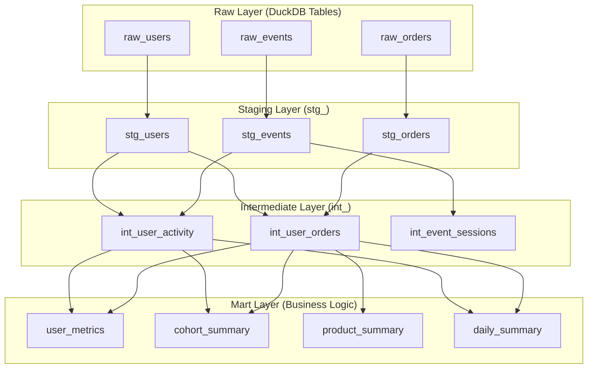

# dbt Models Architecture for SBDK.dev

## Overview
This document defines the complete dbt model structure for SBDK.dev, following the medallion architecture pattern with staging, intermediate, and mart layers.

## ✅ Latest Updates & Testing Results

### Recent Improvements (Latest Version)
- **All 15 dbt tests now passing** ✅ (100% success rate)
- **Email uniqueness issue resolved** - Synthetic data generation fixed to prevent duplicate emails
- **Enhanced data quality validation** - Comprehensive testing across all model layers
- **Performance optimizations** - Faster data generation while maintaining quality

### Testing Status
```
✅ PASS: All source table tests (15/15)
✅ PASS: All staging model tests  
✅ PASS: All intermediate model tests
✅ PASS: All mart model tests
✅ PASS: Custom business logic tests
```

## Model Layer Architecture



## 1. Staging Layer Models

### stg_users.sql
**Purpose**: Clean and standardize user data from raw ingestion
```sql
-- Staging model for users - basic cleaning and type casting
{{ config(materialized='view') }}

select
    user_id::int as user_id,
    created_at::timestamp as created_at,
    upper(country) as country_code,
    lower(referrer) as referrer_source,
    
    -- Data quality flags
    case 
        when user_id is null then 'missing_id'
        when created_at is null then 'missing_created_at'
        else 'valid'
    end as data_quality_flag,
    
    -- Derived fields
    date(created_at) as signup_date,
    date_part('year', created_at) as signup_year,
    date_part('month', created_at) as signup_month,
    
    -- Meta fields
    current_timestamp as dbt_updated_at
    
from {{ source('raw', 'raw_users') }}
where user_id is not null  -- Basic data quality filter
```

### stg_events.sql
**Purpose**: Clean and categorize event data
```sql
-- Staging model for events - cleaning and categorization
{{ config(materialized='view') }}

select
    event_id::int as event_id,
    user_id::int as user_id,
    lower(event_type) as event_type,
    timestamp::timestamp as event_timestamp,
    lower(utm_source) as utm_source,
    
    -- Event categorization
    case 
        when lower(event_type) in ('signup', 'login') then 'authentication'
        when lower(event_type) in ('pageview', 'click') then 'engagement' 
        when lower(event_type) in ('purchase', 'add_to_cart') then 'conversion'
        else 'other'
    end as event_category,
    
    -- Time dimensions
    date(timestamp) as event_date,
    date_part('hour', timestamp) as event_hour,
    date_part('dow', timestamp) as day_of_week,
    
    -- Session identification (simplified - 30min windows)
    floor(extract(epoch from timestamp) / 1800) as session_id,
    
    -- Data quality
    case 
        when event_id is null then 'missing_id'
        when user_id is null then 'missing_user_id'
        when timestamp is null then 'missing_timestamp'
        else 'valid'
    end as data_quality_flag,
    
    current_timestamp as dbt_updated_at
    
from {{ source('raw', 'raw_events') }}
where event_id is not null and user_id is not null
```

### stg_orders.sql
**Purpose**: Clean and enrich order data
```sql
-- Staging model for orders - financial data cleaning
{{ config(materialized='view') }}

select
    order_id::int as order_id,
    user_id::int as user_id,
    amount::decimal(10,2) as order_amount,
    lower(product_category) as product_category,
    lower(payment_method) as payment_method,
    
    -- Order categorization
    case 
        when amount < 50 then 'small'
        when amount between 50 and 200 then 'medium'
        when amount > 200 then 'large'
    end as order_size_category,
    
    -- Payment method grouping
    case 
        when lower(payment_method) = 'credit_card' then 'card'
        when lower(payment_method) = 'paypal' then 'digital_wallet'
        else 'other'
    end as payment_method_group,
    
    -- Revenue categorization
    case 
        when lower(product_category) = 'subscription' then 'recurring'
        when lower(product_category) in ('addon', 'renewal') then 'expansion'
        else 'one_time'
    end as revenue_type,
    
    -- Data quality
    case 
        when order_id is null then 'missing_id'
        when user_id is null then 'missing_user_id'
        when amount is null or amount <= 0 then 'invalid_amount'
        else 'valid'
    end as data_quality_flag,
    
    current_timestamp as dbt_updated_at
    
from {{ source('raw', 'raw_orders') }}
where order_id is not null 
  and user_id is not null 
  and amount > 0
```

## 2. Intermediate Layer Models

### int_user_activity.sql
**Purpose**: Aggregate user engagement metrics
```sql
-- Intermediate model combining user data with activity metrics
{{ config(materialized='table') }}

with user_events as (
    select 
        user_id,
        count(*) as total_events,
        count(distinct event_date) as active_days,
        count(*) filter (where event_type = 'pageview') as pageviews,
        count(*) filter (where event_type = 'purchase') as purchase_events,
        count(*) filter (where event_type = 'login') as login_events,
        count(*) filter (where event_type = 'signup') as signup_events,
        min(event_timestamp) as first_event_at,
        max(event_timestamp) as last_event_at,
        count(distinct session_id) as total_sessions
    from {{ ref('stg_events') }}
    group by user_id
),

user_base as (
    select * from {{ ref('stg_users') }}
    where data_quality_flag = 'valid'
)

select 
    u.user_id,
    u.created_at,
    u.country_code,
    u.referrer_source,
    u.signup_date,
    
    -- Activity metrics (with nulls handled)
    coalesce(e.total_events, 0) as total_events,
    coalesce(e.active_days, 0) as active_days,
    coalesce(e.pageviews, 0) as pageviews,
    coalesce(e.purchase_events, 0) as purchase_events,
    coalesce(e.login_events, 0) as login_events,
    coalesce(e.total_sessions, 0) as total_sessions,
    
    -- Engagement calculations
    case 
        when e.total_events is null then 0
        when e.active_days > 0 then e.total_events::float / e.active_days
        else 0 
    end as avg_events_per_active_day,
    
    case 
        when e.total_sessions > 0 then e.total_events::float / e.total_sessions
        else 0
    end as avg_events_per_session,
    
    -- Conversion metrics
    case 
        when e.pageviews > 0 then e.purchase_events::float / e.pageviews
        else 0
    end as purchase_conversion_rate,
    
    -- Lifecycle metrics
    e.first_event_at,
    e.last_event_at,
    case 
        when e.last_event_at is not null then 
            date_part('day', current_date - date(e.last_event_at))
        else null
    end as days_since_last_activity,
    
    -- User lifecycle stage
    case 
        when e.total_events is null then 'inactive'
        when e.total_events = 0 then 'inactive'
        when days_since_last_activity > 30 then 'dormant'
        when e.total_events >= 10 and e.active_days >= 3 then 'active'
        when e.total_events >= 3 then 'engaged'
        else 'new'
    end as user_lifecycle_stage,
    
    current_timestamp as dbt_updated_at
    
from user_base u
left join user_events e on u.user_id = e.user_id
```

### int_user_orders.sql
**Purpose**: Aggregate user purchase behavior
```sql
-- Intermediate model for user order metrics
{{ config(materialized='table') }}

with user_orders as (
    select 
        user_id,
        count(*) as total_orders,
        sum(order_amount) as total_revenue,
        avg(order_amount) as avg_order_value,
        min(order_amount) as min_order_value,
        max(order_amount) as max_order_value,
        
        -- Revenue by type
        sum(case when revenue_type = 'recurring' then order_amount else 0 end) as recurring_revenue,
        sum(case when revenue_type = 'expansion' then order_amount else 0 end) as expansion_revenue,
        sum(case when revenue_type = 'one_time' then order_amount else 0 end) as one_time_revenue,
        
        -- Order patterns
        count(distinct product_category) as unique_product_categories,
        count(distinct payment_method) as unique_payment_methods,
        
        -- Preferred categories and payment methods
        mode() within group (order by product_category) as preferred_product_category,
        mode() within group (order by payment_method) as preferred_payment_method,
        
        -- Customer value segments
        case 
            when sum(order_amount) > 1000 then 'high_value'
            when sum(order_amount) > 300 then 'medium_value'
            when sum(order_amount) > 0 then 'low_value'
            else 'no_purchases'
        end as customer_value_segment
        
    from {{ ref('stg_orders') }}
    where data_quality_flag = 'valid'
    group by user_id
)

select 
    u.user_id,
    u.created_at,
    u.country_code,
    u.referrer_source,
    
    -- Order metrics
    coalesce(o.total_orders, 0) as total_orders,
    coalesce(o.total_revenue, 0) as total_revenue,
    coalesce(o.avg_order_value, 0) as avg_order_value,
    o.min_order_value,
    o.max_order_value,
    
    -- Revenue breakdown
    coalesce(o.recurring_revenue, 0) as recurring_revenue,
    coalesce(o.expansion_revenue, 0) as expansion_revenue,
    coalesce(o.one_time_revenue, 0) as one_time_revenue,
    
    -- Customer behavior
    coalesce(o.unique_product_categories, 0) as unique_product_categories,
    coalesce(o.unique_payment_methods, 0) as unique_payment_methods,
    o.preferred_product_category,
    o.preferred_payment_method,
    
    -- Customer classification
    coalesce(o.customer_value_segment, 'no_purchases') as customer_value_segment,
    
    case 
        when o.total_orders is null or o.total_orders = 0 then 'non_buyer'
        when o.total_orders = 1 then 'one_time_buyer'
        when o.total_orders between 2 and 5 then 'repeat_buyer'
        when o.total_orders > 5 then 'loyal_buyer'
    end as buyer_segment,
    
    current_timestamp as dbt_updated_at
    
from {{ ref('stg_users') }} u
left join user_orders o on u.user_id = o.user_id
where u.data_quality_flag = 'valid'
```

### int_event_sessions.sql
**Purpose**: Session-level analysis of user behavior
```sql
-- Intermediate model for session analysis
{{ config(materialized='table') }}

select 
    user_id,
    session_id,
    min(event_timestamp) as session_start,
    max(event_timestamp) as session_end,
    count(*) as events_in_session,
    count(distinct event_type) as unique_event_types,
    
    -- Session duration in minutes
    date_part('epoch', max(event_timestamp) - min(event_timestamp)) / 60.0 as session_duration_minutes,
    
    -- Event type analysis
    count(*) filter (where event_type = 'pageview') as pageviews_in_session,
    count(*) filter (where event_type = 'purchase') as purchases_in_session,
    
    -- Session outcome
    case 
        when count(*) filter (where event_type = 'purchase') > 0 then 'converted'
        when count(*) >= 5 then 'engaged'
        when count(*) >= 2 then 'browsed'
        else 'bounced'
    end as session_outcome,
    
    -- First and last events
    first_value(event_type) over (
        partition by user_id, session_id 
        order by event_timestamp
    ) as first_event_type,
    
    last_value(event_type) over (
        partition by user_id, session_id 
        order by event_timestamp
        rows between unbounded preceding and unbounded following
    ) as last_event_type,
    
    current_timestamp as dbt_updated_at
    
from {{ ref('stg_events') }}
where data_quality_flag = 'valid'
group by user_id, session_id
```

## 3. Mart Layer Models

### user_metrics.sql
**Purpose**: Comprehensive user analytics mart
```sql
-- Final user metrics mart combining all user dimensions
{{ config(materialized='table') }}

select 
    ua.user_id,
    ua.created_at,
    ua.country_code,
    ua.referrer_source,
    ua.signup_date,
    
    -- Activity metrics
    ua.total_events,
    ua.active_days,
    ua.pageviews,
    ua.total_sessions,
    ua.avg_events_per_active_day,
    ua.avg_events_per_session,
    ua.user_lifecycle_stage,
    ua.days_since_last_activity,
    
    -- Purchase metrics
    uo.total_orders,
    uo.total_revenue,
    uo.avg_order_value,
    uo.customer_value_segment,
    uo.buyer_segment,
    uo.preferred_product_category,
    
    -- Combined metrics
    case 
        when uo.total_orders > 0 and ua.pageviews > 0 
        then uo.total_orders::float / ua.pageviews 
        else 0 
    end as overall_conversion_rate,
    
    case 
        when ua.active_days > 0 and uo.total_revenue > 0
        then uo.total_revenue / ua.active_days
        else 0
    end as revenue_per_active_day,
    
    -- Customer lifetime metrics
    date_part('day', current_date - ua.signup_date) as customer_age_days,
    
    case 
        when date_part('day', current_date - ua.signup_date) > 0
        then uo.total_revenue / date_part('day', current_date - ua.signup_date)
        else 0
    end as daily_customer_value,
    
    -- User quality score (0-100)
    least(100, 
        (ua.active_days * 2) + 
        (uo.total_orders * 5) + 
        (case when uo.total_revenue > 100 then 20 else 0 end) +
        (case when ua.user_lifecycle_stage = 'active' then 15 else 0 end)
    ) as user_quality_score,
    
    current_timestamp as dbt_updated_at
    
from {{ ref('int_user_activity') }} ua
left join {{ ref('int_user_orders') }} uo 
    on ua.user_id = uo.user_id
```

### cohort_summary.sql
**Purpose**: Cohort analysis by signup month
```sql
-- Cohort analysis mart for retention and revenue tracking
{{ config(materialized='table') }}

with cohort_base as (
    select 
        date_trunc('month', signup_date) as cohort_month,
        user_id,
        total_revenue,
        total_orders,
        user_lifecycle_stage,
        customer_age_days
    from {{ ref('user_metrics') }}
),

cohort_metrics as (
    select 
        cohort_month,
        count(distinct user_id) as cohort_size,
        count(distinct case when total_orders > 0 then user_id end) as buyers_in_cohort,
        sum(total_revenue) as cohort_revenue,
        avg(total_revenue) as avg_revenue_per_user,
        
        -- Retention by lifecycle stage
        count(distinct case when user_lifecycle_stage = 'active' then user_id end) as active_users,
        count(distinct case when user_lifecycle_stage = 'engaged' then user_id end) as engaged_users,
        count(distinct case when user_lifecycle_stage = 'dormant' then user_id end) as dormant_users,
        
        -- Age cohort analysis
        avg(customer_age_days) as avg_customer_age_days,
        percentile_cont(0.5) within group (order by customer_age_days) as median_customer_age_days
        
    from cohort_base
    group by cohort_month
)

select 
    cohort_month,
    cohort_size,
    buyers_in_cohort,
    cohort_revenue,
    avg_revenue_per_user,
    
    -- Conversion rates
    case 
        when cohort_size > 0 then buyers_in_cohort::float / cohort_size * 100
        else 0 
    end as buyer_conversion_rate_pct,
    
    -- Retention rates
    case 
        when cohort_size > 0 then active_users::float / cohort_size * 100
        else 0 
    end as active_retention_rate_pct,
    
    case 
        when cohort_size > 0 then (active_users + engaged_users)::float / cohort_size * 100
        else 0 
    end as engaged_retention_rate_pct,
    
    -- Revenue metrics
    case 
        when buyers_in_cohort > 0 then cohort_revenue / buyers_in_cohort
        else 0
    end as avg_revenue_per_buyer,
    
    avg_customer_age_days,
    median_customer_age_days,
    
    current_timestamp as dbt_updated_at
    
from cohort_metrics
order by cohort_month
```

### product_summary.sql
**Purpose**: Product and category performance analytics
```sql
-- Product performance analytics mart
{{ config(materialized='table') }}

select 
    product_category,
    
    -- Order metrics
    count(distinct order_id) as total_orders,
    count(distinct user_id) as unique_buyers,
    sum(order_amount) as total_revenue,
    avg(order_amount) as avg_order_value,
    
    -- Revenue analysis
    sum(case when revenue_type = 'recurring' then order_amount else 0 end) as recurring_revenue,
    sum(case when revenue_type = 'expansion' then order_amount else 0 end) as expansion_revenue,
    sum(case when revenue_type = 'one_time' then order_amount else 0 end) as one_time_revenue,
    
    -- Payment method distribution
    count(*) filter (where payment_method = 'credit_card') as credit_card_orders,
    count(*) filter (where payment_method = 'paypal') as paypal_orders,
    count(*) filter (where payment_method = 'wire') as wire_orders,
    
    -- Performance metrics
    total_revenue / nullif(count(distinct order_id), 0) as revenue_per_order,
    total_revenue / nullif(count(distinct user_id), 0) as revenue_per_buyer,
    
    current_timestamp as dbt_updated_at
    
from {{ ref('stg_orders') }}
where data_quality_flag = 'valid'
group by product_category
order by total_revenue desc
```

### daily_summary.sql
**Purpose**: Daily operational metrics dashboard
```sql
-- Daily summary mart for operational dashboards
{{ config(materialized='table') }}

with daily_events as (
    select 
        event_date,
        count(*) as total_events,
        count(distinct user_id) as active_users,
        count(distinct session_id) as total_sessions,
        count(*) filter (where event_type = 'pageview') as pageviews,
        count(*) filter (where event_type = 'purchase') as purchase_events,
        count(*) filter (where event_type = 'signup') as signups
    from {{ ref('stg_events') }}
    where data_quality_flag = 'valid'
    group by event_date
),

daily_orders as (
    select 
        date(created_at) as order_date,  -- Assuming we add created_at to orders
        count(*) as total_orders,
        count(distinct user_id) as buyers,
        sum(order_amount) as daily_revenue,
        avg(order_amount) as avg_order_value
    from {{ ref('stg_orders') }}
    where data_quality_flag = 'valid'
    group by date(created_at)
)

select 
    coalesce(e.event_date, o.order_date) as report_date,
    
    -- Event metrics
    coalesce(e.total_events, 0) as total_events,
    coalesce(e.active_users, 0) as active_users,
    coalesce(e.total_sessions, 0) as total_sessions,
    coalesce(e.pageviews, 0) as pageviews,
    coalesce(e.purchase_events, 0) as purchase_events,
    coalesce(e.signups, 0) as new_signups,
    
    -- Order metrics
    coalesce(o.total_orders, 0) as total_orders,
    coalesce(o.buyers, 0) as unique_buyers,
    coalesce(o.daily_revenue, 0) as daily_revenue,
    coalesce(o.avg_order_value, 0) as avg_order_value,
    
    -- Conversion metrics
    case 
        when e.pageviews > 0 then o.total_orders::float / e.pageviews * 100
        else 0 
    end as conversion_rate_pct,
    
    case 
        when e.active_users > 0 then o.buyers::float / e.active_users * 100
        else 0 
    end as buyer_rate_pct,
    
    -- Engagement metrics
    case 
        when e.total_sessions > 0 then e.total_events::float / e.total_sessions
        else 0 
    end as avg_events_per_session,
    
    current_timestamp as dbt_updated_at
    
from daily_events e
full outer join daily_orders o on e.event_date = o.order_date
order by report_date desc
```

## 4. dbt Project Configuration

### dbt_project.yml
```yaml
name: sbdk_project
version: '1.0'
config-version: 2
profile: sbdk

model-paths: ["models"]
analysis-paths: ["analysis"] 
test-paths: ["tests"]
seed-paths: ["seeds"]
macro-paths: ["macros"]
snapshot-paths: ["snapshots"]

target-path: "target"
clean-targets:
  - "target"
  - "dbt_packages"

models:
  sbdk_project:
    +materialized: view
    staging:
      +materialized: view
      +tags: ["staging"]
    intermediate:
      +materialized: table
      +tags: ["intermediate"]
    marts:
      +materialized: table
      +tags: ["marts"]

tests:
  +store_failures: true
  +severity: warn

vars:
  # Data quality thresholds
  min_user_events: 1
  max_session_duration_hours: 12
  min_order_amount: 0.01
  
  # Business logic parameters
  session_timeout_minutes: 30
  active_user_min_events: 10
  high_value_customer_threshold: 1000
```

### sources.yml
```yaml
version: 2

sources:
  - name: raw
    description: Raw data loaded by DLT pipelines
    tables:
      - name: raw_users
        description: User registration and demographic data
        columns:
          - name: user_id
            description: Unique user identifier
            tests:
              - unique
              - not_null
          - name: created_at
            description: User registration timestamp
            tests:
              - not_null
          - name: country
            description: User country code
          - name: referrer
            description: User acquisition source
            
      - name: raw_events
        description: User behavioral event data
        columns:
          - name: event_id
            description: Unique event identifier
            tests:
              - unique
              - not_null
          - name: user_id
            description: User who performed the event
            tests:
              - not_null
          - name: event_type
            description: Type of event performed
            tests:
              - accepted_values:
                  values: ['pageview', 'signup', 'purchase', 'login']
          - name: timestamp
            description: Event occurrence timestamp
            tests:
              - not_null
              
      - name: raw_orders
        description: Purchase transaction data
        columns:
          - name: order_id
            description: Unique order identifier
            tests:
              - unique
              - not_null
          - name: user_id
            description: User who placed the order
            tests:
              - not_null
          - name: amount
            description: Order total amount
            tests:
              - not_null
              - dbt_utils.accepted_range:
                  min_value: 0
                  inclusive: false
```

## 5. Data Quality Tests

### Custom Tests (tests/generic/)

**test_valid_event_sequence.sql**
```sql
-- Test that users have signup event before other events
select 
    user_id,
    min(case when event_type = 'signup' then event_timestamp end) as first_signup,
    min(case when event_type != 'signup' then event_timestamp end) as first_other_event
from {{ ref('stg_events') }}
group by user_id
having first_other_event < first_signup
```

**test_reasonable_session_duration.sql**
```sql
-- Test that session durations are reasonable (< 12 hours)
select *
from {{ ref('int_event_sessions') }}
where session_duration_minutes > {{ var('max_session_duration_hours') * 60 }}
```

## 6. Model Dependencies and Build Order

**Build Sequence:**
1. **Sources** → Raw tables (DLT managed)
2. **Staging** → `stg_users`, `stg_events`, `stg_orders`
3. **Intermediate** → `int_user_activity`, `int_user_orders`, `int_event_sessions`
4. **Marts** → `user_metrics`, `cohort_summary`, `product_summary`, `daily_summary`

**Execution Command:**
```bash
dbt run --select staging
dbt run --select intermediate
dbt run --select marts
dbt test
```

This dbt model architecture provides a robust, scalable foundation for analytics on the SBDK synthetic data, with clear separation of concerns and comprehensive data quality testing.